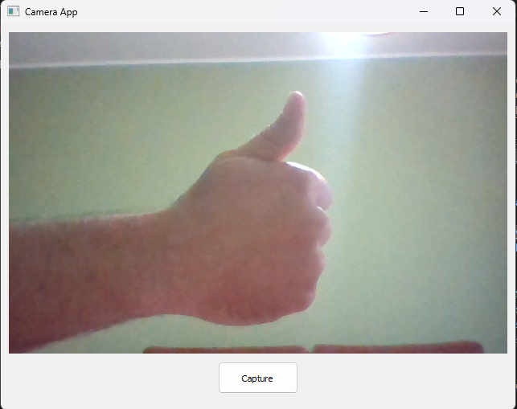
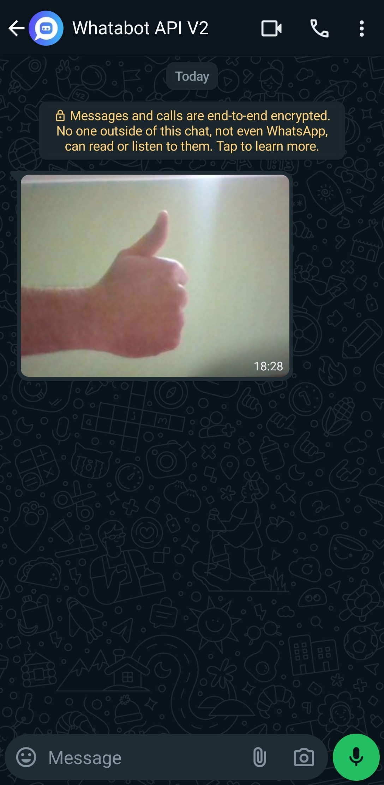

# Send WhatsApp Photos using Whatabot API - Python

#### A simple project showing how to send WhatsApp Images using [https://whatabot.io](https://whatabot.io) as a message broker - A good idea of use would be as a smart doorbell (maybe with a raspberry pi)

## Requirements

1. Python 3 installed
2. Whatabot API Key: See below

## Installing requirements

```shell
pip install -r requirements.txt
```

## Getting Whatabot API key

1. Visit [https://whatabot.io/get-started](https://whatabot.io/get-started)
2. Follow the steps indicated on the websitellow the steps
3. Copy your API key. **Do not share it or embed in code the public can view**
4. Paste it into the YOUR_API_KEY placeholder in main.py

## Running

```shell
python main.py
```

## Sending WhatsApp photos using Whatabot API




